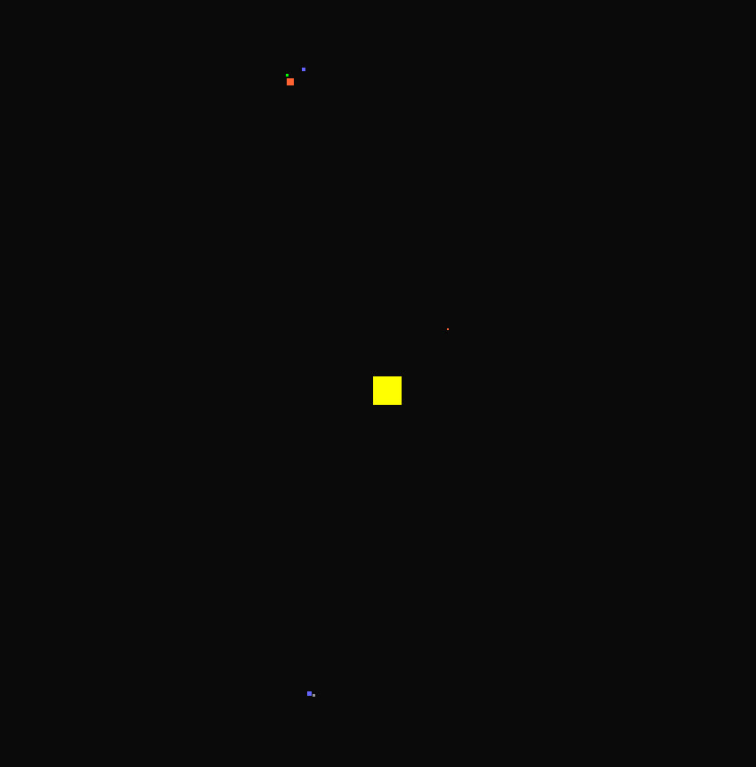

# Haskell planets



This is a simple simulation of gravity based planet motions,
based on Newton's universal law of gravity.

The values used for simulation aren't true to real world,
but the underlying physics should be.

The rendering is handled using [SDL2](https://hackage.haskell.org/package/sdl2).

## Quick start

```console
cabal run
```

*Note that you will need GHC, Cabal and probably sdl2 installed*


## Using 

To speed up simulation use `W` and to slow down use `S`.
